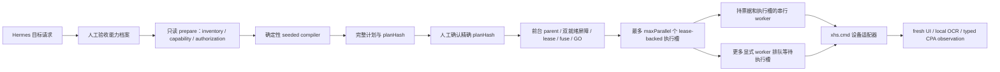
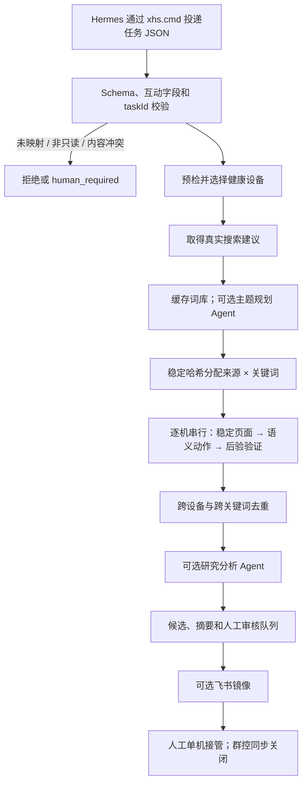

# 系统架构

## 执行分层

1. **统一入口与策略层**：`xhs.cmd` 是唯一操作者入口；它为本次进程树生成内存会话密钥，内部 `xhs-agent.mjs` 只负责严格路由、参数白名单、风险确认和单机/分组约束。
2. **任务与计划层**：Hermes 只表达目标并投递严格请求。只读研究继续使用 `research-task.schema.json`；定制化操作必须先由确定性编译器生成完整复合计划、条件分支和 `planHash`，再等待人工确认精确哈希。Hermes 不能自行批准或在运行时改写计划。
3. **编排层**：`research-core.mjs` 继续负责只读研究；独立的 `supervised_composite_v1` 编排器负责显式有限设备清单、能力档案约束的 `maxParallel`、全员就绪屏障、父 lease、共享动作预算和单调全局熔断。首个能力档案可以只验收 2 台，但这不是永久治理上限。两个模式不共用宽化后的执行入口。
4. **效卫能力与 ADB 验证层**：31 个 action 先进入严格能力目录；只有精确版本、API/ADB 身份、逐别名 action 和物理设备绑定均通过的公开子能力才走效卫。外层门禁只为单次请求签发 30 秒内有效的 HMAC 能力票据，票据绑定 action、公开别名、物理设备、版本、端点、请求哈希和授权后态；内部进程还验证调用父进程来自规范包装脚本。自制 JSON、旧 policy 或被改写的请求都会在发送前失败。ADB/UI 负责独立后验验证，未验收能力保持受控 ADB 路径。
5. **输入法档案层**：逐机盘点并批准输入通道，保存别名级状态，并对焦点、清空、输入回显和原输入法恢复逐项验证。
6. **设备执行层**：`adb-research-provider.mjs` 启动 App、读取 UI 层级、解析页面、输入搜索词、滚动列表并提取公开候选。真实序列号只存在于本地配置及被 Git 忽略的本地诊断/资产产物；普通审计、公开报告和外部镜像只使用别名。
7. **页面规则层**：`xhs-page-engine.mjs` 使用公共版本规则和可选设备覆盖规则评分页面，并按语义选择器解析目标。
8. **AI 与 CPA 感知层**：`ai-role-runner.mjs` 仅在主题规划、页面恢复、结果分析或人工请求草稿时调用模型；CPA 只接收受限图片 artifact 并返回闭合的角色观察 Schema。模型和 CPA 永不返回动作、坐标或执行授权。
9. **人机协作与结果层**：效卫提供投屏、分组和人工接管。只读研究不执行互动；经人工确认的复合计划只允许 `ensure_liked` 与 `ensure_favorited`。评论发送、私信、关注、主页修改、发布、删除、登录、权限和支付均不进入动作注册表。本地 JSON/JSONL 是真相源；飞书只作为审核队列和闭合白名单设备资料的可选镜像。

## Text input strategy

- Prefer a Xiaowei text profile only when the exact Xiaowei version, API/ADB identity, alias, `AcceptedDeviceSerialsByAlias` physical binding, bridge IME, and `imeList/selectIme/inputText` actions are all accepted. Otherwise use an approved native Chinese IME, then an approved device-side Unicode IME. The profiles are described in `docs/INPUT_METHOD_WORKFLOW.md` and the local config templates.
- Do not assume a universal language-switch API. The IME may require a one-time UI calibration of its `中/英` mode.
- Before each non-ASCII input, verify the focused edit field and selected IME; after input, read the field and require an exact echo.
- If calibration or echo fails twice on one device, capture evidence and stop that device. Do not silently fall back to an unverified computer/bridge keyboard.

## 监督式复合执行

`supervised_composite_v1` 是独立于现有 `feed_read_only` 的定制化通道。只有在当前 CLI、测试和预检确认其能力已经实现并启用后才能使用。

- 能力档案验收、只读准备、计划编译、人工审核、批准和执行机械分离。候选/合成档案不会因文件存在而激活；生产验收回执必须绑定 `capabilityProfileId/hash`、`acceptedBy=human`、时间、验收证据哈希和精确能力限制。
- `prepare` 只为显式设备清单刷新 inventory、capability 和逐机互动授权，不导航 App；计划与批准同时绑定能力档案 ID/hash、inventory snapshot hash 和 capability snapshot hash。
- 一次有效批准授权该有限计划自动执行到底，普通步骤之间不再逐步询问；只有强制停止、人工中断、批准失效或明确的人类最终动作会暂停。
- 默认执行契约是“启动严格、运行轻量、账号状态变化时强校验”：启动阶段只做一次完整 profile/snapshot/plan/approval/device/ticket/slot 验证并生成不可变内存上下文；普通只读发送只查内存中的 epoch、fuse、slot 和 step；点赞/收藏前后才执行 fresh UI、目标重绑、同步 intent 和后态持久化。
- 编译阶段可以按版本化 seed 排列已允许的高层动作；执行期不再随机，也不能新增目标、补量或重排。随机坐标、随机停留、拟人速度和规避控制均禁止。
- 第一版闭合动作注册表只包含 Feed 语义浏览、图文正文滚动、视频切换、评论计数/公开评论读取、返回/有限恢复，以及 `ensure_liked`、`ensure_favorited`。不暴露通用 tap/swipe/input/shell/ADB/循环表达式。
- 复合计划显式指定有限设备清单；`maxParallel` 不超过选中设备数和当前已测试能力档案。每台 worker 内严格串行。计划可选择 `all_ready`，或能力档案验收过的 `ready_subset_after_deadline`：达到 deadline 后只让已通过锁/能力屏障且满足 `minReady` 的 worker 进入本轮，其他设备记为 `skipped_not_ready` 且不补量。GO 只开启调度，parent 最多签发 `maxParallel` 个执行槽 lease。
- worker 在每次导航、CPA 或设备发送前必须同时持有 parent 签发的授权票据和当前执行槽 lease，并重新验证 parent lease、fuse、计划/批准哈希。每个状态变化拥有唯一且不可转移的 `operationId/budgetSlotId`；no-op、跳过或未使用的槽不补给其他目标。熔断或人工中断先撤销全部执行槽并禁止新签发。
- 整个 parent 共享一个由计划明确声明、人工可见且原子执行的有限状态变化预算。仓库不写死永久数值上限；预算必须符合当前能力档案和已批准计划。trusted 兼容模板默认仍是每台一次点赞和一次收藏。
- 点赞/收藏是 ensure-state，而不是 toggle。动作前重新绑定当前详情身份，动作后读取新鲜 UI；结果不明确时绝不重发，并触发全局熔断。
- 普通只读导航失败可只停止本 worker；敏感页、身份漂移、计划/批准不一致、父 lease 丢失、证据/预算损坏、人工中断或互动结果不明会停止全部 worker。
- 现有 `feed batch` V1.1 保持只读并继续拒绝互动字段，不作为复合状态变化执行器。

### 性能优先快路径

- 完整 hash、receipt、inventory、capability、authorization 和 ticket 验证集中在 worker 启动/恢复边界；普通运行不反复读文件或调用 provider。
- 连续纯只读判断在没有发送设备动作、没有人工输入且快照未过期时可复用同一不可变 UI snapshot；每次 UI mutation 后、页面/目标不确定时以及点赞/收藏前后必须刷新。
- 只读 events/evidence 有界缓冲并批量落盘；互动 intent/operation ledger/后态、fuse 和终态摘要仍同步持久化。
- CPA 使用能力档案中的 workflow soft timeout，先于 gateway/provider hard timeout降级到 `unknown`，避免云端等待阻塞手机队列。

评论读取先从新鲜 UI 获取计数，再尝试本地 `numeric_count` OCR，最后才调用 CPA `comment_count`；失败统一进入浅层 `unknown` 分支。预算第一次有效观测后冻结，评论容器连续两次无新增即提前结束。CPA 是无设备权限的不可信传感器，只返回计数、类型和置信度等闭合字段，不返回动作、坐标、路径、URL 或自由 prompt。

## 只读研究状态机

来源入口不存在时，只跳过对应来源，不判定整台设备失败。搜索与搜索建议按关键词生成工作单元；热搜和推荐各按主题生成一个工作单元，避免无意义地重复采集。

## 页面识别

页面状态包括：

- `HOME_FEED`
- `SEARCH_ENTRY`
- `SEARCH_SUGGESTIONS`
- `SEARCH_RESULTS`
- `TRENDING`
- `RECOMMENDED`
- `IMAGE_NOTE`
- `VIDEO_NOTE`
- `COMMENT_PANEL`
- `NETWORK_ERROR`
- `UPDATE_MODAL`
- `LOGIN_OR_CHALLENGE`
- `UNKNOWN`

规则按“小红书版本 + Android SDK + 页面状态”共享。只有布局确实不同的手机，才以“设备别名 + 分辨率 + DPI + 已标定小红书版本”建立覆盖规则。版本不一致时，设备覆盖自动失效。

候选页面分数至少为 `0.85`，并且比第二候选高 `0.15` 才被接受；否则归为 `UNKNOWN`。选择器优先级为：

1. `resource-id`
2. 文字或 `content-desc`
3. 稳定锚点及父子关系
4. 仅限已标定设备和版本的覆盖规则

页面引擎本身不返回屏幕坐标。执行器在当前、新鲜的 UI 层级中找到语义节点后，才临时读取该节点边界进行一次点击；不能把一台手机的边界复制给另一台。

## 页面稳定与动作验证

执行动作前，执行器每 500 ms 读取一次 UI 层级。连续两次归一化指纹一致才认为页面稳定，最长等待 8 秒。归一化会忽略坐标、计数和相对时间等动态值。

每个动作都需要：

- 已验证的前置页面；
- 当前层级中解析出的语义目标；
- 明确的目标页面或输出；
- 动作后的稳定检测和后验验证。

点击等可能有副作用的动作最多执行一次。后验状态不确定时记录失败，不自动重放。

## 图文、视频与评论

- 搜索和推荐工作单元只对首个可语义定位的候选做保守详情抽样；其余候选保留列表公开字段，避免扩大点击面。
- 图文笔记只滚动已识别的内容容器，且受 `maxNoteScrolls` 约束。
- `research_read_only` 不通过视频主画面切换下一条；`supervised_composite_v1` 只有在计划明确包含 `video.advance`、当前视频 surface 可语义验证且动作后能证明视频身份变化时，才允许发送一次受限手势，结果不明不得重试。
- 评论区仅在任务/计划和冻结预算允许时从已抽样详情打开；只读取公开统计或脱敏片段，只滚动已验证的评论容器。
- 评论输入框、发送按钮和其他互动控件都不属于自动目标。

## 中文输入

输入顺序为：

1. 已通过版本、身份、逐动作和逐机档案验收的效卫文本 API；
2. 经人工批准、按设备别名标定且具有中文子类型的原生输入法；
3. 经人工批准、按设备别名标定的 Unicode 设备端输入法；
4. 效卫桌面由人工粘贴。

普通 ASCII 搜索词可以使用 ADB 文本输入。原生输入法路径只把 ASCII 拼音送入当前输入法，再从新鲜 UI 层级精确选择完整中文候选；普通 `adb shell input text` 不直接承载中文。任何输入完成后必须重新读取搜索框并逐字确认回显，随后恢复任务开始前的默认输入法；不一致时返回 `human_required`，不能提交乱码搜索。

## AI 介入点

| 角色 | 触发 | 自动上限 | 继续条件 |
| --- | --- | --- | --- |
| 主题规划 | 已取得真实建议，且主题缓存无效 | 新主题 1 次，缓存 30 天 | 只返回意图组、查询排序和排除词 |
| 页面恢复 | 本地 UI 指纹/解析连续失败 | 每任务 2 次 | 置信度 ≥ 0.90，并在新 UI 中重找语义节点 |
| 研究分析 | 至少取得 5 条候选 | 每任务 1 次 | 只排序、聚类和说明理由 |
| 评论辅助 | 人工主动请求 | 不计自动预算 | 只返回一条草稿，不填写、不发送 |
| 维护 Agent | 版本变化或相同失败签名达到当前策略定义的系统性失败 quorum | 每个新签名 1 次 | 只产生故障包、规则或代码建议 |

`research_read_only` 的自动模型调用总硬上限为每任务 4 次。复合计划使用其人工可见的有限 `maxVisionCallsTotal` 和能力档案上限；两者互不替代。视觉缓存键由脱敏截图内容哈希、提示词版本和模型名组成；同一截图不会重复调用。没有模型配置时，已标定的只读流程可保持 0 次调用。

## 并发、幂等与失败传播

- `research_read_only` 工作单元使用稳定哈希分配；并发由当前研究能力档案约束，每台内部严格串行。
- `supervised_composite_v1` 使用显式有限设备清单、能力档案约束的 `maxParallel`、已批准的 all-ready/ready-subset 启动策略、一个共享 GO 和 lease-backed 执行槽 ledger；GO 只开启调度，worker 必须持 parent 授权票据及当前执行槽才可运行。首个验收档可以是 2 台，之后可经压力与故障验收扩容；不发现、不重分配、不替换设备、互动目标或不可转移的动作预算槽。
- 相同 `taskId` 和相同任务哈希返回 `duplicate` 及原结果；相同 ID 对应不同任务内容时拒绝运行。
- 每个已结束工作单元原子写入 `checkpoint.json`；进程在最终摘要写出前中断时，重启只执行尚未记录的单元。
- 只读研究中，离线设备上尚未开始的工作单元最多重分配一次；复合计划不重分配。
- 正式工作单元中，单台设备连续两次影响设备健康的失败后被隔离；中性跳过不增加也不清零计数，其他设备继续。
- 正式工作单元中，相同失败签名达到当前策略定义的系统性失败 quorum 时触发全局熔断，未开始的工作不再扩散；前置主题发现单独记错，单机交接首个不确定结果即停。
- 登录、验证码、风险提示、支付、私信或权限挑战立即全局停止并转人工。

候选优先按公开笔记 ID 去重；没有 ID 时使用作者、标题和媒体类型哈希，并对近似标题作高阈值 n-gram 去重。

## 结果产物

每个任务目录至少包含：

- `candidates.jsonl`：去重后的公开候选；
- `human-review.jsonl`：需要人工判断、输入或接管的项目；
- `summary.json`：状态、计数、设备别名、熔断信息和产物路径；
- `checkpoint.json`：已结束工作单元和各设备连续失败计数，用于安全恢复；
- `topic-discovery.json` 与 `ai-status.json`：真实建议发现结果和各 AI 角色调用/跳过状态；
- 可选 `analysis.json` 与 `maintenance-request.json`：候选分析和只允许规则/代码建议的维护请求；
- 每台设备独立事件日志，任务结束后统一合并。

结果状态固定为 `completed`、`partial`、`human_required`、`failed` 或 `duplicate`。

人工交接不改变研究任务状态。`Open-ReviewCandidate.ps1` 只为一个已映射别名创建单设备 Provider，精确重找本地候选并验证详情身份；成功返回 `pausedForHuman=true`，随后不再发出设备命令。
