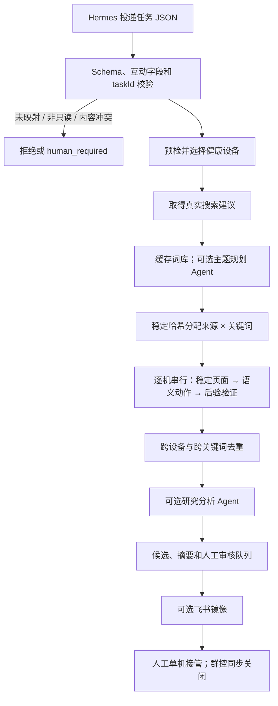

# 系统架构

## 执行分层

1. **任务层**：Hermes 只投递符合 `research-task.schema.json` 的 JSON。任务必须是 `research_read_only` 和 `human_final`。
2. **研究编排层**：`research-core.mjs` 校验任务，按稳定哈希分配工作单元，限制三台并行、单机串行，并处理幂等、预算、去重、设备隔离和全局熔断。
3. **输入法档案层**：逐机盘点原生中文输入法，校准语言模式，保存别名级状态，并对每次非 ASCII 输入做精确回显。
4. **设备执行层**：`adb-research-provider.mjs` 启动 App、读取 UI 层级、解析页面、输入搜索词、滚动列表并提取公开候选。设备序列号只存在于本地配置，运行记录使用别名。
5. **页面规则层**：`xhs-page-engine.mjs` 使用公共版本规则和可选设备覆盖规则评分页面，并按语义选择器解析目标。
6. **AI 事件层**：`ai-role-runner.mjs` 仅在主题规划、页面恢复、结果分析或人工请求草稿时调用模型；缓存和预算独立记录。
7. **人机协作层**：效卫提供投屏、分组和单机人工接管。任何对外互动都不进入自动执行器。
8. **结果层**：本地 JSON/JSONL 是真相源；飞书只作为候选和人工审核状态的可选镜像。

## Text input strategy

- Prefer a per-device native IME profile with a verified `中文（中国）` subtype. The profile and calibration status are described in `docs/INPUT_METHOD_WORKFLOW.md` and `config/input-methods.example.psd1`.
- Do not assume a universal language-switch API. The IME may require a one-time UI calibration of its `中/英` mode.
- Before each non-ASCII input, verify the focused edit field and selected IME; after input, read the field and require an exact echo.
- If calibration or echo fails twice on one device, capture evidence and stop that device. Do not silently fall back to an unverified computer/bridge keyboard.

## 只读研究状态机

来源入口不存在时，只跳过对应来源，不判定整台设备失败。搜索与搜索建议按关键词生成工作单元；热搜和推荐各按主题生成一个工作单元，避免无意义地重复采集。

## 页面识别

页面状态包括：

- `HOME_FEED`
- `SEARCH_ENTRY`
- `SEARCH_SUGGESTIONS`
- `SEARCH_RESULTS`
- `TRENDING`
- `RECOMMENDED`
- `IMAGE_NOTE`
- `VIDEO_NOTE`
- `COMMENT_PANEL`
- `NETWORK_ERROR`
- `UPDATE_MODAL`
- `LOGIN_OR_CHALLENGE`
- `UNKNOWN`

规则按“小红书版本 + Android SDK + 页面状态”共享。只有布局确实不同的手机，才以“设备别名 + 分辨率 + DPI + 已标定小红书版本”建立覆盖规则。版本不一致时，设备覆盖自动失效。

候选页面分数至少为 `0.85`，并且比第二候选高 `0.15` 才被接受；否则归为 `UNKNOWN`。选择器优先级为：

1. `resource-id`
2. 文字或 `content-desc`
3. 稳定锚点及父子关系
4. 仅限已标定设备和版本的覆盖规则

页面引擎本身不返回屏幕坐标。执行器在当前、新鲜的 UI 层级中找到语义节点后，才临时读取该节点边界进行一次点击；不能把一台手机的边界复制给另一台。

## 页面稳定与动作验证

执行动作前，执行器每 500 ms 读取一次 UI 层级。连续两次归一化指纹一致才认为页面稳定，最长等待 8 秒。归一化会忽略坐标、计数和相对时间等动态值。

每个动作都需要：

- 已验证的前置页面；
- 当前层级中解析出的语义目标；
- 明确的目标页面或输出；
- 动作后的稳定检测和后验验证。

点击等可能有副作用的动作最多执行一次。后验状态不确定时记录失败，不自动重放。

## 图文、视频与评论

- 搜索和推荐工作单元只对首个可语义定位的候选做保守详情抽样；其余候选保留列表公开字段，避免扩大点击面。
- 图文笔记只滚动已识别的内容容器，且受 `maxNoteScrolls` 约束。
- 视频页不得通过主画面上滑切换下一条；出现意外视频页时停止该工作单元并转人工。
- 评论区仅在 `commentMode` 和预算允许时，从已抽样详情打开；只读取公开统计或少量脱敏片段。
- 评论输入框、发送按钮和其他互动控件都不属于自动目标。

## 中文输入

输入顺序为：

1. 经人工批准、按设备别名标定且具有中文子类型的原生输入法；
2. 已通过逐动作验收的效卫逐机文本 API；
3. 经人工批准、按设备别名标定的 Unicode 设备端输入法；
4. 效卫桌面由人工粘贴。

普通 ASCII 搜索词可以使用 ADB 文本输入。原生输入法路径只把 ASCII 拼音送入当前输入法，再从新鲜 UI 层级精确选择完整中文候选；普通 `adb shell input text` 不直接承载中文。任何输入完成后必须重新读取搜索框并逐字确认回显，随后恢复任务开始前的默认输入法；不一致时返回 `human_required`，不能提交乱码搜索。

## AI 介入点

| 角色 | 触发 | 自动上限 | 继续条件 |
| --- | --- | --- | --- |
| 主题规划 | 已取得真实建议，且主题缓存无效 | 新主题 1 次，缓存 30 天 | 只返回意图组、查询排序和排除词 |
| 页面恢复 | 本地 UI 指纹/解析连续失败 | 每任务 2 次 | 置信度 ≥ 0.90，并在新 UI 中重找语义节点 |
| 研究分析 | 至少取得 5 条候选 | 每任务 1 次 | 只排序、聚类和说明理由 |
| 评论辅助 | 人工主动请求 | 不计自动预算 | 只返回一条草稿，不填写、不发送 |
| 维护 Agent | 版本变化或两个设备同故障 | 每个新签名 1 次 | 只产生故障包、规则或代码建议 |

自动模型调用总硬上限为每任务 4 次。视觉缓存键由脱敏截图内容哈希、提示词版本和模型名组成；同一截图不会重复调用。没有模型配置时，已标定的只读流程可保持 0 次调用。

## 并发、幂等与失败传播

- 工作单元使用稳定哈希分配；最多三台设备并行，每台内部严格串行。
- 相同 `taskId` 和相同任务哈希返回 `duplicate` 及原结果；相同 ID 对应不同任务内容时拒绝运行。
- 每个已结束工作单元原子写入 `checkpoint.json`；进程在最终摘要写出前中断时，重启只执行尚未记录的单元。
- 离线设备上尚未开始的工作单元最多重分配一次。
- 单台设备连续两次转场失败后被隔离，其他设备继续。
- 两台设备出现相同失败签名时触发全局熔断，未开始的工作不再扩散。
- 登录、验证码、风险提示、支付、私信或权限挑战立即全局停止并转人工。

候选优先按公开笔记 ID 去重；没有 ID 时使用作者、标题和媒体类型哈希，并对近似标题作高阈值 n-gram 去重。

## 结果产物

每个任务目录至少包含：

- `candidates.jsonl`：去重后的公开候选；
- `human-review.jsonl`：需要人工判断、输入或接管的项目；
- `summary.json`：状态、计数、设备别名、熔断信息和产物路径；
- `checkpoint.json`：已结束工作单元和各设备连续失败计数，用于安全恢复；
- `topic-discovery.json` 与 `ai-status.json`：真实建议发现结果和各 AI 角色调用/跳过状态；
- 可选 `analysis.json` 与 `maintenance-request.json`：候选分析和只允许规则/代码建议的维护请求；
- 每台设备独立事件日志，任务结束后统一合并。

结果状态固定为 `completed`、`partial`、`human_required`、`failed` 或 `duplicate`。

人工交接不改变研究任务状态。`Open-ReviewCandidate.ps1` 只为一个已映射别名创建单设备 Provider，精确重找本地候选并验证详情身份；成功返回 `pausedForHuman=true`，随后不再发出设备命令。
