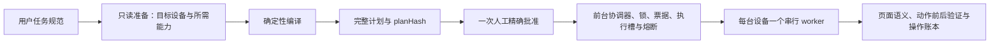

# 系统架构

## 唯一执行链

所有设备相关任务都从 `xhs.cmd` 进入：

```text
xhs.cmd
→ scripts/xhs-agent.mjs
→ PowerShell 规范包装器
→ 统一任务编译、审核、批准与协调器
→ 单设备串行执行器
→ 已验证的页面语义与设备适配器
```

`feed run` 和 `feed batch` 只负责把旧参数转换成统一任务，不再拥有独立执行器、限制或确认流程。只读研究当前仍保留单独实现，待完成搜索结果和 URL 数据源适配后再并入统一任务入口；在并入前不得把它描述成已经统一。

## 权限与计划边界

- 用户明确批准的规范化任务是本次运行唯一的业务意图来源。
- 模板只能补默认值，不能覆盖显式参数。
- 编译器冻结设备、数据源、动作顺序、条件分支、次数、并发、恢复边界和停止条件，并生成确定性的 `planHash`。
- 人工只确认一次完整计划和精确哈希；批准后不中途逐步重复确认。
- 运行时只能选择已编译分支，不能临时增加动作、目标、次数或设备。
- 能力档案表示当前已测试实现能力，不是仓库永久业务上限；扩大能力必须先补实现、测试和人工验收回执。

## 当前自动动作边界

当前已实现并验收的账户状态动作只有确保点赞和确保收藏。它们都是确保状态操作，不是盲目切换：动作前重新绑定目标并读取状态，动作后读取新鲜 UI 验证；结果不明确时不重发并打开全局熔断。

评论发送、关注、私信、分享、发布、删除、资料或账号修改尚未进入已实现的高层动作注册表。用户命令可以决定已实现动作的目标、顺序和次数，但不能把不存在的执行能力变成可运行能力。新增动作需要同时补齐封闭参数结构、页面前后条件、证据、恢复语义、停止规则和测试。

验证码、异常活动或平台风控、意外登录或身份验证、系统权限、支付确认、私密页面、设备或目标身份漂移仍是强制停止条件。

## 统一任务生命周期



准备阶段只检查本次选择的设备和计划实际需要的能力。无关设备离线、无关能力降级和未选设备数量变化只能作为诊断信息，不能阻止任务。目标设备锁、任务锁、能力快照、身份绑定、批准哈希和执行 nonce 必须在启动时验证。

普通只读步骤使用不可变运行上下文中的轻量门禁。账户状态变化前后执行强校验，并同步持久化意图、操作槽和结果。进程在发送后、验证前中断时，恢复只能读取当前状态，不能再次发送同一动作。

## 多设备调度

- 任务显式列出有限设备，或在编译前按固定偏好从在线、解锁、空闲设备中确定性选择。
- `maxParallel` 由用户任务提出，并由当前已验收能力档案校验；仓库不设置永久设备数或并发数上限。
- 每台设备有独立任务 ID、设备锁、检查点、事件账本和证据目录。
- 未选择设备的异常不影响本次任务；目标设备失败只停止该 worker，除非触发全局强制停止或系统性失败条件。
- 失败设备的剩余动作不会转移给其他设备，也不会自动发现或替换手机。

## 页面、观察与 CPA

页面识别基于新鲜 Android UI 层级、可见文本或内容描述、稳定关系和经标定的设备覆盖规则。每次 UI 变化后、页面或目标不确定时，以及账户状态变化前后，都必须刷新观察。手势发送和时间经过都不等于成功。

CPA 只是只读、不可信的受限传感器。它只接收有界的内存图片工件并返回封闭角色结构，不返回动作、坐标、命令、路径、URL 或自由提示。点赞和收藏结果不能只由 CPA 判定。

## 证据与恢复

- 状态步骤遵循 `observed → target_bound → intent_recorded → sent → verified → committed`。
- 只有 committed 步骤计入完成数。
- 只读事件允许有界缓冲；账户状态意图、操作账本、模糊后态、熔断和终态摘要必须同步持久化。
- 一次尝试只输出一个完成或阻塞报告，不自动重复相同预检、诊断或运行。
- `data/`、截图、UI XML、账号信息、令牌和本地配置只保留在 Git 忽略的本地运行目录，不进入仓库或聊天。

## 只读研究的过渡状态

现有研究入口继续执行公开内容的只读采集，不执行账户状态变化。它与统一任务的 Feed 数据源不是同一个执行器。完成搜索结果和 URL 列表适配、确定性编译、统一证据格式及兼容转换后，研究旧入口才能删除；在此之前，仓库审计会把它标为待整合而不是已完成。
